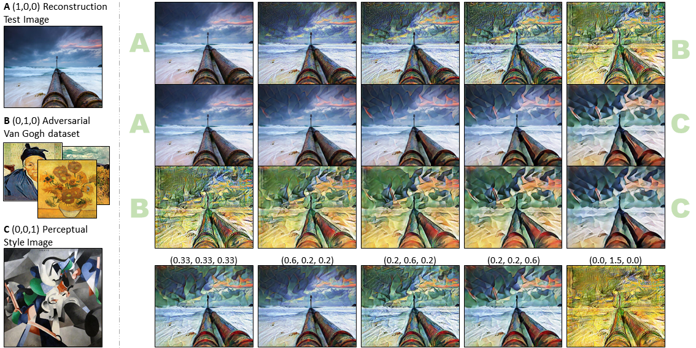
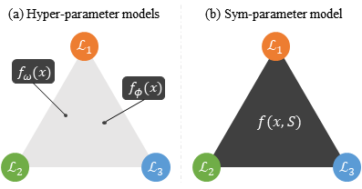
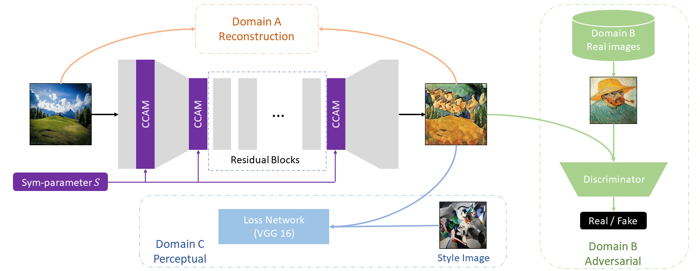

# Sym-Parameterized Dynamic Inference for Mixed-Domain Image Translation

This repository is official Pytorch implementations of SGN in the following paper.

Simyung Chang, SeongUk Park, John Yang and Nojun Kwak, "Image Translation to Mixed-Domain using Sym-Parameterized Generative Network", ICCV2019,  [arXiv](https://arxiv.org/abs/1811.12362)

This code is built on [Pytorch-CycleGAN](https://github.com/aitorzip/PyTorch-CycleGAN) and tested on Pytorch 0.4.1.




Dynamic Inference for Mixed-Domain Image Translation.




The concept of sym-parameter.




Overall Structure of SGN for Three Different Losses.


## Train

### Prepare training data

```
./download_dataset <dataset_name>
```

<dataset_name> for the models in the paper.

Model 1: vangogh2photo

Model 2: ukiyoe2photo

Model 3 : summer2winter_yosemite, monet2photo


### Train 

```
python train.py --dataroot <data_dir> --style_image <image_file>
```

To train the Model 1

```
python train.py --dataroot 'datasets/vangogh2photo/' --style_image 'images/style-images/udnie.jpg'
```


## Test

Pre-trained Models and Test code will be available soon.


## Citation
```
@article{chang2018image,
  title={Image Translation to Mixed-Domain using Sym-Parameterized Generative Network},
  author={Chang, Simyung and Park, SeongUk and Yang, John and Kwak, Nojun},
  journal={arXiv preprint arXiv:1811.12362},
  year={2018}
}
```


## Acknowledgments
Our code is built on [Pytorch-CycleGAN](https://github.com/aitorzip/PyTorch-CycleGAN).
